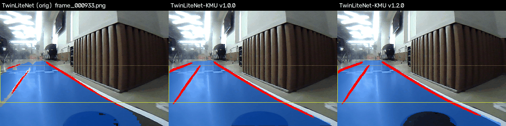
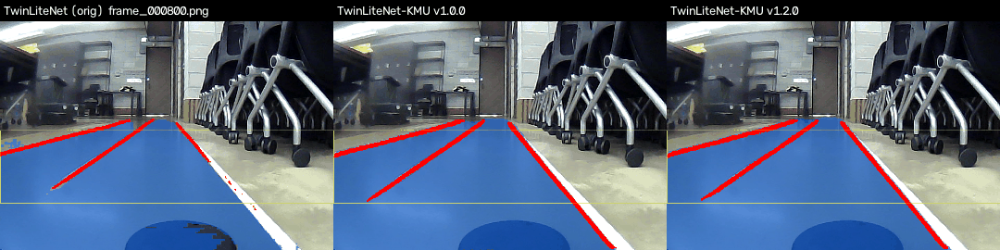
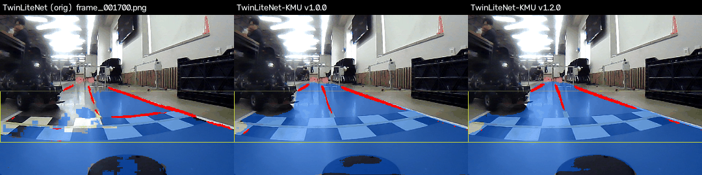
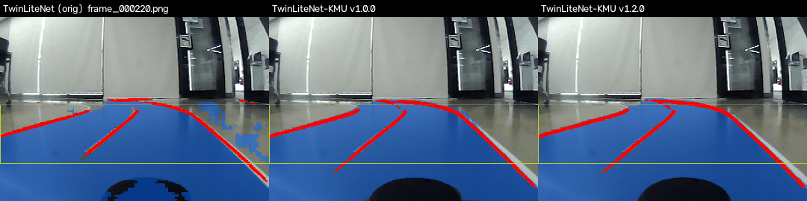
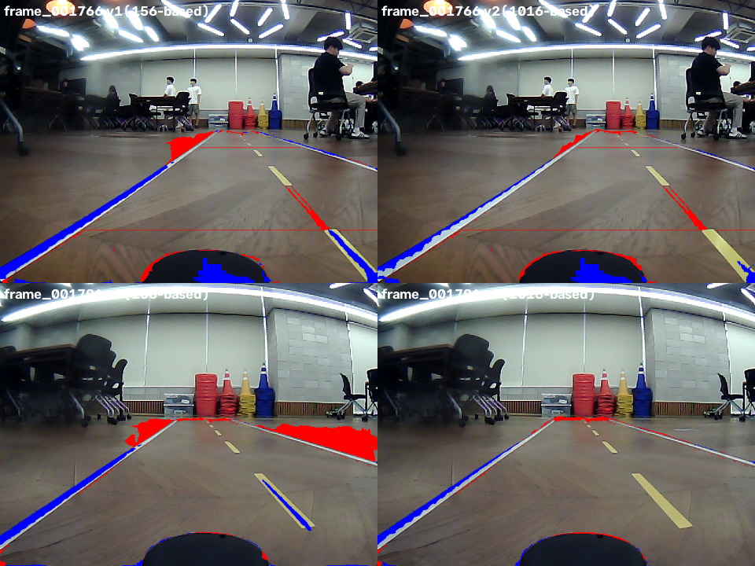
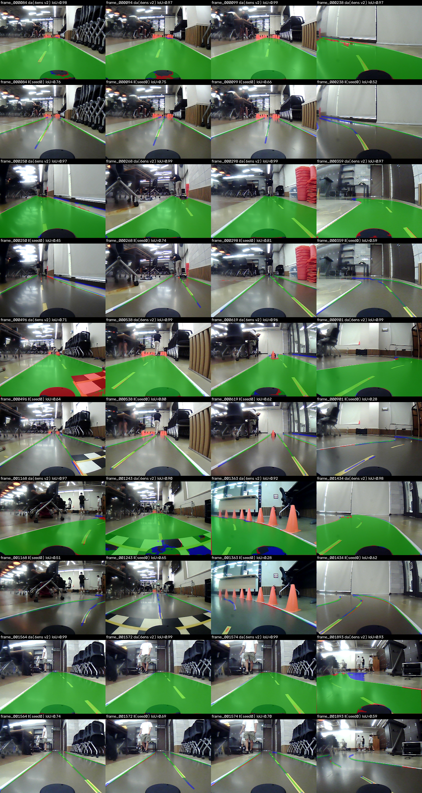

<div align="center">
<h1>TwinLiteNet-KMU 🏎️</h1>
<p><a href="https://auto-contest.kookmin.ac.kr/">제9회 국민대학교 자율주행 경진대회</a> 참여작 —
<a href="https://github.com/mastic-choi/UMK">UMK/track_drive</a>의 차선·주행가능영역
인식 모델을, 미래관(신관) 4층 자율주행스튜디오 트랙에 맞춰 파인튜닝한다.</p>
</div>

## Background

`track_drive`는 원조 [TwinLiteNet](https://github.com/chequanghuy/TwinLiteNet)을 da(주행가능영역)
/ ll(차선) 듀얼헤드 세그멘테이션 모델로 쓰는데, 실차 영상에서 두 가지 문제가 확인됐다:

1. 노란색 차선을 거의 못 잡음
2. 역광/글레어 구간, 그리고 **커브·좌회전 구간에서 주행가능영역을 트랙 경계 밖까지 잘못 칠함**

같은 트랙·같은 차량으로만 주행하는 좁은 도메인이라 범용 모델보다 우리 데이터로 직접
파인튜닝하는 게 효율적이라 판단해서 시작한 프로젝트. 베이스 모델은 원조 TwinLiteNet의
후속작인 [TwinLiteNetPlus](https://github.com/chequanghuy/TwinLiteNetPlus)(CAAM 어텐션
모듈 추가, nano/small/medium/large 4단계 크기 지원)를 썼고, 이를 우리 트랙 데이터로
파인튜닝한 결과물을 **TwinLiteNet-KMU**라고 부른다.

### 차량 사양

자이카 Y모델 기본 사양: AMD Ryzen(64bit, 8-core/16thread) + AMD Radeon RX Vega 8,
Traxxas 1:10 스케일 섀시, 170° 어안렌즈 640×480 카메라. 대회 후반부에
**reComputer Super J4012**(NVIDIA Jetson Orin NX 16GB, JetPack 6 / Ubuntu 22.04)가
추가로 제공되어 **본선 경기는 이 PC로 진행**함.

## Results

### 실제 주행 비교 (원조 TwinLiteNet vs TwinLiteNet-KMU v1.0.0 vs v1.2.0)

`dataset/`의 연속 프레임을 그대로 이어 붙여 실제 주행처럼 재생되는 GIF, 3-way
비교(왼쪽부터 원조 TwinLiteNet / v1.0.0 / v1.2.0). 파란색=주행가능영역,
빨간색=차선, 노란 박스=실차 제어에 실제로 쓰는 ROI.

**직진 구간(frame_000933~000985, 대조군)** — 직진에서는 원조 모델도 원래 크게 나쁘지
않다는 걸 보여주는 대조군. 문제는 특히 커브에서 두드러짐.



**커브 구간(S자, frame_000800~000935)** — 원조 모델은 커브 내내 주행가능영역이 트랙
경계 밖 회색 바닥까지 계속 삐져나감.



**frame_001766 부근(frame_001700~001830)** — 딥앙상블 검증(§ 아래 섹션)에서 v1.0.0의
약점 프레임으로 확인됐던 구간, 사람·라바콘이 섞여있는 복잡한 장면.



**frame_000220~000252** — 커브에서 직선 복도로 이어지는 구간.



### 라벨링 파이프라인 → 최종 모델

왼쪽부터: **① 원조 TwinLiteNet 추론 → ② 우리가 만든 da 라벨(사람 라벨링 + 딥앙상블
pseudo-label) → ③ YOLOPv2 기반 ll 라벨(skeleton 정제) → ④ 이 라벨들로 학습한
TwinLiteNet-KMU v1.2.0의 추론 결과**. 즉 ②③이 학습 데이터, ④가 그 데이터로 학습한
결과물.


### 파인튜닝 전/후 정량 비교 (사람 GT 1016장 기준, 동일 기준 측정)

원조 TwinLiteNet은 우리 트랙 GT로 학습/검증된 적이 없어서 여기엔 없음(대신 위 주행
비교 GIF가 old vs new 비교 자료) — 이 표는 **TwinLiteNet-KMU 버전 간(v1.0.0 →
v1.2.0)**을 같은 사람 GT(`bootstrap_v2`, 1016장) 기준 IoU로 직접 비교한 것.

| Model | Drivable Area IoU | Lane Line IoU |
|:-----:|:-------------------:|:--------------:|
| TwinLiteNetPlus (pretrained, BDD100K, 파인튜닝 0회) | 0.815 | 0.132 |
| TwinLiteNet-KMU v1.0.0 (medium, pseudo_dataset_v2 1068장) | 0.945 | 0.577 |
| **TwinLiteNet-KMU v1.2.0 (medium, bootstrap_v2+lap_005 3446장)** | **0.957** :arrow_up: | **0.599** :arrow_up: |

v1.2.0은 딥앙상블로 개선한 da 라벨 + 지그재그 주행으로 수집한 lap_005(비평행 각도
상황 보강) 데이터로 재학습한 버전 — 자세한 라벨링 경로는 아래 "라벨링 품질 개선"
섹션 참고.

### 모델 크기 (config별 파라미터 수)

TwinLiteNetPlus는 nano/small/medium/large 4단계를 지원 — 우리는 정확도와 속도를
같이 고려해 **medium**을 최종 채택.

| Config | Params |
|:------:|:------:|
| nano | 33,379 |
| small | 121,552 |
| **medium (채택)** | **478,876** |
| large | 1,943,911 |

### 원조 TwinLiteNet vs TwinLiteNet-KMU — 크기/속도

| Model | Params | Input | Speed (RX 9070 XT, ROCm, batch=1) |
|:-----:|:------:|:-----:|:----------------------------------:|
| TwinLiteNet (원조) | 439,633 | 640×360 | 46.3 fps |
| **TwinLiteNet-KMU (medium)** | 478,876 | 640×384 | **91.5 fps** |

파라미터 수는 비슷한데(약 9% 많음) 추론 속도는 약 2배 — CAAM 어텐션 구조가 원조보다
효율적인 것으로 보임(엄밀한 알고리즘 단위 프로파일링은 안 해봄, 같은 GPU/배치에서의
end-to-end 측정치).

### 실차 배포 PC(AMD 미니 PC) 기준 참고 속도

실차에 실제로 들어가는 **AMD Ryzen 7 5700U 미니 PC**(내장 Radeon Graphics
Lucienne/Vega 8, ROCm 미지원)에서 두 모델 다 onnxruntime **CPU**로 직접 측정한 값 —
학습에 쓴 RX 9070 XT(ROCm)와는 완전히 다른 하드웨어라 위 표와 나란히 비교할 수는
없고 참고용:

| Model | Input | Device | Speed (batch=1) |
|:-----:|:-----:|:------:|:----------------:|
| TwinLiteNet (원조) | 640×360 | AMD Ryzen 7 5700U, **CPU only** | 12.4 fps (80.5ms/frame) |
| **TwinLiteNet-KMU (medium, v1.2.0)** | 640×384 | AMD Ryzen 7 5700U, **CPU only** | **10.8 fps** (92.6ms/frame) |

**GPU(RX 9070 XT)에서는 KMU가 원조보다 ~2배 빠른데(91.5 vs 46.3fps), CPU에서는
반대로 원조가 KMU보다 살짝 더 빠르다** — CAAM 어텐션 구조가 GPU 병렬화엔 유리하지만
CPU 단일 스레드 연산에서는 오히려 오버헤드로 작용하는 것으로 보임(엄밀한 프로파일링은
안 해봄, end-to-end 측정치). 두 모델 다 RX 9070 XT ROCm 대비 CPU 속도가 1/4~1/8
수준 — iGPU가 ROCm 미지원이라 GPU 가속 없이 CPU로만 돈 결과. 자세한 경위는
[`PROGRESS.md` §2.27](./PROGRESS.md) 참고.

## 학습된 모델

- **`outputs/models/best.onnx`** (+ `best.onnx.data`) — TwinLiteNet-KMU
  [v1.2.0](https://github.com/mastic-choi/TwinLiteNet-KMU-finetune/releases/tag/v1.2.0),
  medium config, 40epoch, ll IOU 기준 best 체크포인트. `track_drive`의
  `TwinLiteNetEngine`과 바로 호환(입력 `images`, 출력 `da`/`ll`, 입력 크기 640×384).
- 실차 반영 시 `perception/dl_lane.py`의 `DL_INPUT_H`를 360 → **384**로 바꿔야 함
  (letterbox 버그 수정 후 학습 해상도가 변경됨 — 자세한 배경은 PROGRESS.md 참고).
- 실차에 바로 쓰기 전에 반드시 실제 주행 테스트로 검증할 것 — 지금까지는 정적
  이미지/ROI 커버리지 기준 검증만 마친 상태.

## 라벨링 품질 개선: 딥앙상블(Deep Ensemble)

da(주행가능영역) 자동 라벨의 품질을 높이기 위해, 사람이 검증한 코퍼스로 medium
config 모델 5개를 시드만 다르게 독립적으로 학습시키고, 이 5개(+기존 배포 모델)의
확률 예측을 평균(soft-vote)해서 pseudo-label을 생성하는 방식을 도입했다 — 여러
모델의 합의로 개별 모델의 편향을 평균화하는
[deep ensemble](https://arxiv.org/abs/1612.01474)(Lakshminarayanan et al., 2017)
기법. **이 5개 모델 자체는 실차에 배포되지 않는다** — 순수하게 자동 라벨 품질을
높이기 위한 도구이고, 실제 배포 모델은 이렇게 만든 라벨로 별도로 학습한 단일
모델이다(라벨링은 여러 모델의 합의로, 배포는 가벼운 단일 모델로 — 국민대
이현기 교수님이 제안해주신 방향).

사람이 검증한 학습 코퍼스를 156장에서 1016장으로 늘려 이 앙상블을 다시 학습한
버전([v1.1.0](https://github.com/mastic-choi/TwinLiteNet-KMU-finetune/releases/tag/v1.1.0))을
검증한 결과, 코퍼스가 작았던 첫 버전에서 장면 다양성 부족으로 오히려 예측이
나빠졌던 프레임들이 뚜렷이 개선됐다(사람 GT 대비 IoU):

| 프레임 | 156장 버전 | 1016장 버전 |
|:---:|:---:|:---:|
| frame_001766 | 0.897 | **0.930** |
| frame_001791 | 0.901 | **0.970** |



빨강=과다검출(FP), 파랑=누락(FN) — 156장 버전(왼쪽)은 커브 바깥쪽 벽·테이블
영역까지 침범하는 게 보이지만 1016장 버전(오른쪽)은 거의 없다.

**사람 라벨 vs 앙상블 자동 라벨 비교** — 딥앙상블이 실제로 사람 라벨을 얼마나
잘 재현하는지 20장(4×5) 스팟체크. **초록=사람이 칠했고 앙상블도 맞게 검출,
빨강=사람은 안 칠했는데 앙상블이 검출(과다검출), 파랑=사람은 칠했는데 앙상블이
놓침(누락)**.



## 우리가 한 것 (요약)

세션별 시행착오와 트러블슈팅 히스토리는 전부 [`PROGRESS.md`](./PROGRESS.md)에
시간순으로 기록돼 있음 — 여기서는 최종적으로 자리잡은 방법론만 요약.

- **데이터**: 실차 원본 2123장(+지그재그 주행 추가 수집분 lap_005 2903장) →
  dHash 근접중복 제거·자동 필터링 후 최종 학습 3446장(bootstrap_v2 1016 +
  lap_005 2430)
- **라벨링**: da는 사람이 CVAT에서 직접 라벨링한 코퍼스(134→1016장, 신뢰검증
  포함)를 딥앙상블(medium×5, soft-vote)로 확장 → lap_005 자동 라벨링(사람이
  육안 검수로 부적절한 프레임 제외), ll은 YOLOPv2(BDD100K 사전학습, 파인튜닝
  0회) 추론을 skeleton화+polyline 단순화로 정제해서 사용 — 여러 SOTA 차선
  모델을 직접 비교한 결과 YOLOPv2가 우리 도메인에서 압도적으로 좋았음(공개
  벤치마크 순위와 무관). 자세한 라벨링 파이프라인은 위 "라벨링 품질 개선"
  섹션 참고
- **학습**: TwinLiteNetPlus medium config, ll 손실 가중치 2배 + ll 디코더 LR 2.5배
  (ll이 da보다 어려운 태스크라 학습 압력을 더 줌)
- **검증**: 학습 로그 숫자만 보지 않고 항상 실제 이미지에 다시 돌려서 old/new 모델을
  나란히 비교 — "커버리지가 높아 보인다" 같은 인상만으로 판단하지 않고 사람 GT 대비
  IoU/과다포함/과소포함을 직접 계산
- **학습 환경**: Google Colab(무료 GPU) → 로컬 Windows(AMD RX 9070 XT, ROCm)로 이전
  (medium config가 Colab에서 너무 오래 걸려서). 원래는 국민대 소프트웨어융합대학
  **FOSCAR** 동아리의 RTX 컴퓨터를 지원받아 쓸 계획이었으나 무산되어, 팀원
  최준수의 개인 PC(RX 9070 XT)로 학습을 진행함

## 레포 구성

```
finetune_twinlitenetplus.ipynb                     # Colab 학습 노트북 (Google Drive 연동)
finetune_twinlitenetplus_local_windows_rocm.ipynb   # 로컬(Windows+ROCm) 학습 노트북
kuac_lane_prelabel_shared.ipynb                     # SAM2+YOLOPv2 기반 pre-labeling Colab 노트북
PROGRESS.md                                          # 세션별 상세 진행 기록 + 시행착오 히스토리
outputs/
  models/best.onnx(.data)                            #   최종 학습 결과물
  montages/                                           #   비교 GIF/몽타주 전체
scripts/                                             # 기능별로 분류된 파이프라인 스크립트
  data_prep/                                          #   원본 프레임 수집·다이어트·triage
  cvat/                                                #   CVAT import/export, 사람 라벨 병합
  pseudo_label/                                        #   da/ll 자동 라벨링 파이프라인 + 공용 유틸
  eval/                                                #   모델 비교·검증·곡률/각도 검출
  montage/                                             #   비교 몽타주/GIF 생성
  export/                                              #   ONNX export
```

데이터셋 원본/중간산출물은 용량 문제로 이 레포에 포함하지 않음(`.gitignore` 참고,
아래 "관련 링크"에서 Drive로 별도 관리).

## 관련 링크

- 데이터셋(원본/중간산출물, Google Drive): [TwinLiteNet-KMU dataset](https://drive.google.com/drive/folders/1BPueQj5-elPWAJizp9um2Z4ZGoI4HCSK?usp=sharing)
- 베이스 모델: [chequanghuy/TwinLiteNetPlus](https://github.com/chequanghuy/TwinLiteNetPlus)
- 원조 모델: [chequanghuy/TwinLiteNet](https://github.com/chequanghuy/TwinLiteNet)
- ll pseudo label 소스: [CAIC-AD/YOLOPv2](https://github.com/CAIC-AD/YOLOPv2)
- 실차 배포 대상: [mastic-choi/UMK](https://github.com/mastic-choi/UMK) (`track_drive` 패키지)

## Special Thanks

이 프로젝트의 딥앙상블(deep ensemble) 라벨링 아이디어를 제안해주신 국민대학교
**이현기** 교수님께 감사드립니다. ([hyungi-lee.github.io](https://hyungi-lee.github.io/))
